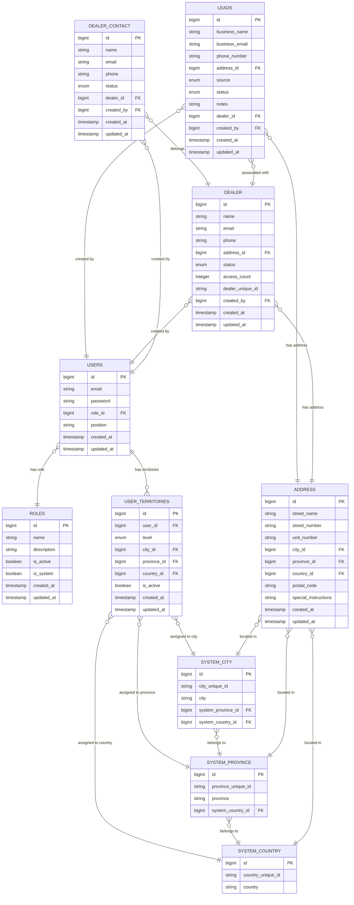
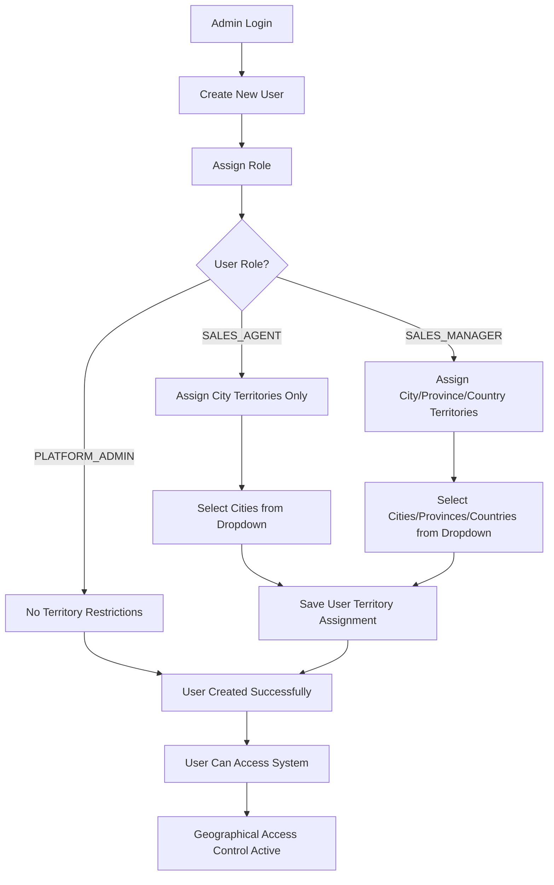
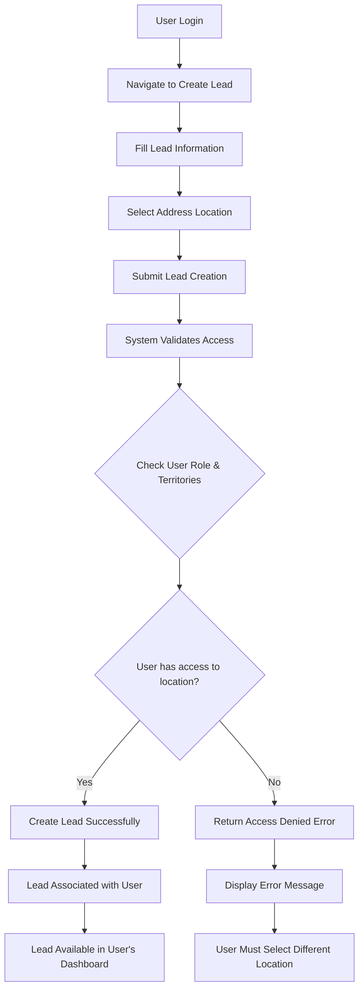
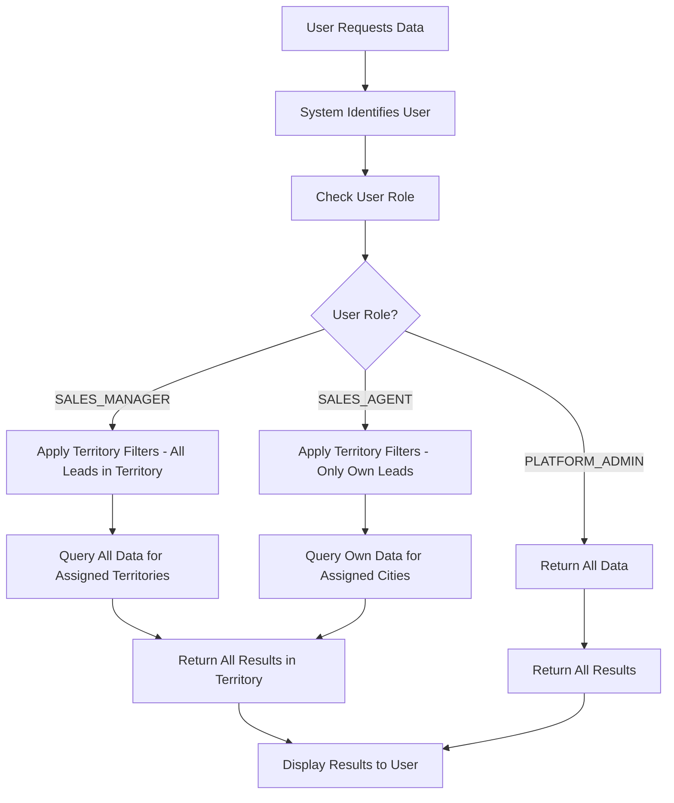
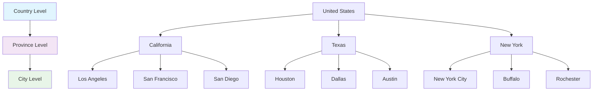
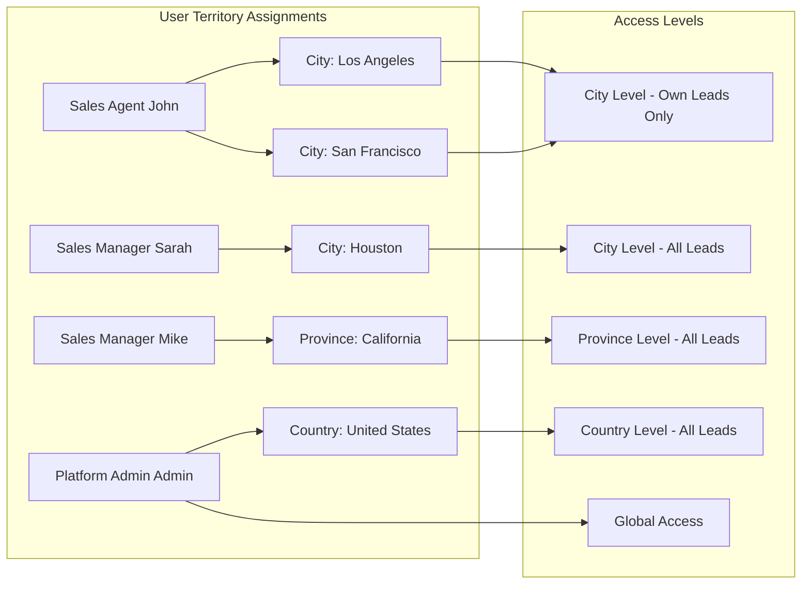
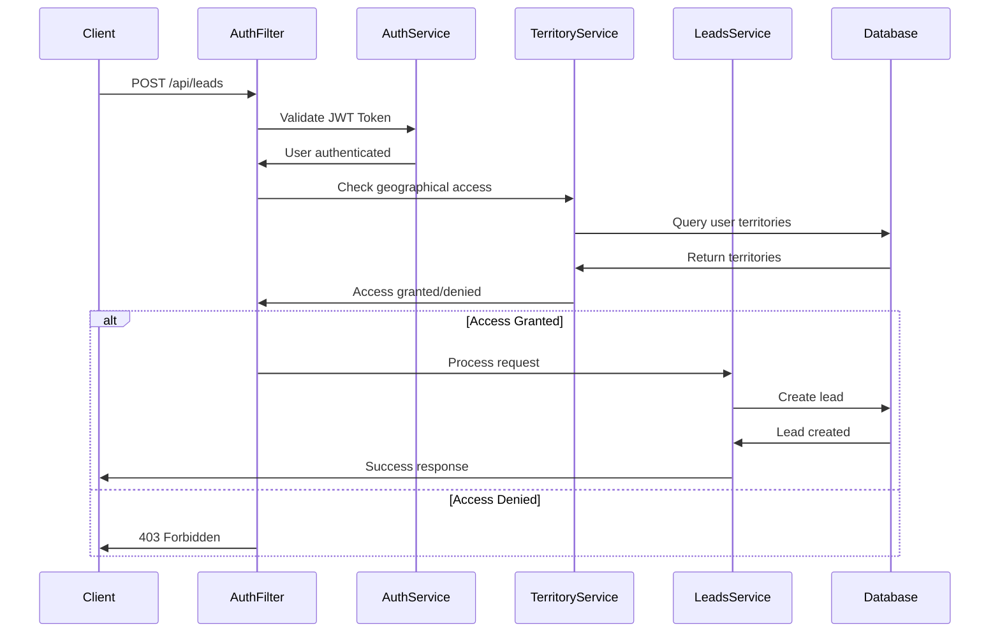
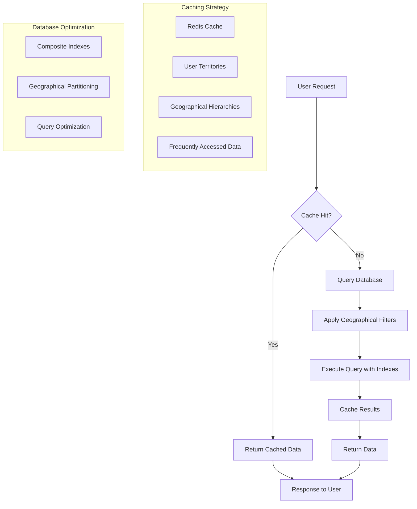
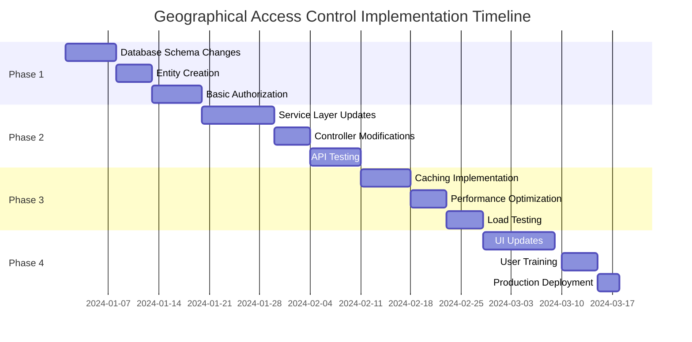

# Geographical Access Control System - Flow Diagrams & Relationships

## 1. Database Entity Relationship Diagram

## 2. User Territory Assignment Flow

## 3. Lead Creation Authorization Flow

## 4. Data Access Control Flow

## 5. Territory Hierarchy Structure

## 6. User Territory Assignment Examples

## 7. API Request Flow with Authorization

## 8. Performance Optimization Strategy

## 9. Implementation Phases Timeline

## 10. Data Flow Summary

### Key Relationships:
1. **User → Territories**: One user can have multiple territory assignments
2. **Territories → Geographical Entities**: Each territory links to city/province/country
3. **Geographical Hierarchy**: Country → Province → City (parent-child relationship)
4. **Data Access**: All business entities (leads, dealers, contacts) inherit geographical access from their addresses

### Access Control Rules:
1. **SALES_AGENT**: Can only access leads they created within assigned cities
2. **SALES_MANAGER**: Can access ALL leads within assigned territories (city/province/country)
3. **PLATFORM_ADMIN**: Has access to all data globally
4. **Territory Inheritance**: Higher-level territories include all lower-level territories within them

### Performance Considerations:
1. **Indexing**: Composite indexes on geographical columns
2. **Caching**: User territories and geographical hierarchies cached in Redis
3. **Query Optimization**: Efficient joins and filtering strategies
4. **Partitioning**: Optional database partitioning for very large datasets 