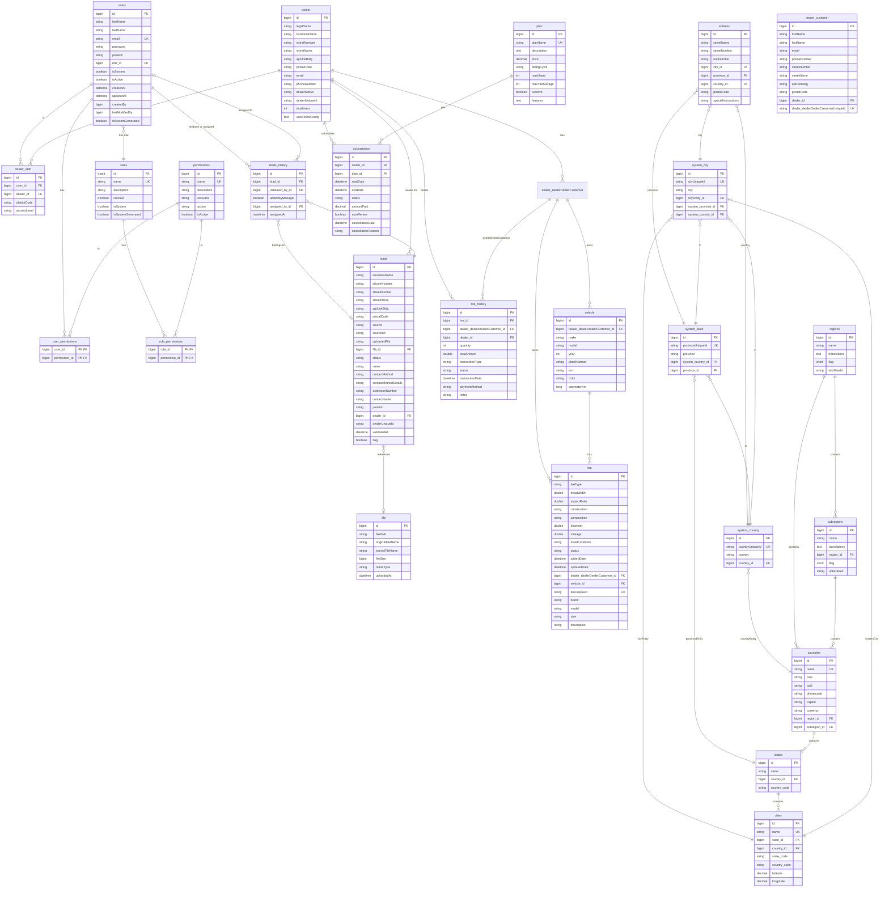

# TreadX System – Entity Relationship Diagram

This document describes the database schema and entity relationships for the TreadX application (tire sales, vendor/dealer portal, territories, and subscriptions). Table names and structure are aligned with the current codebase.

---

## Full ERD (Mermaid)

---
